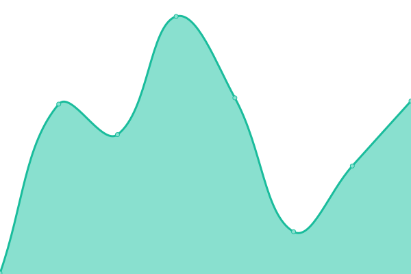

# [📈 Live Status](https://status.zoph.me): <!--live status--> **🟩 All systems operational**

This repository contains the open-source uptime monitor and status page for [Victor GRENU](https://zoph.me), powered by [Upptime](https://github.com/upptime/upptime).

With [Upptime](https://upptime.js.org), you can get your own unlimited and free uptime monitor and status page, powered entirely by a GitHub repository. We use [Issues](https://github.com/z0ph/status/issues) as incident reports, [Actions](https://github.com/z0ph/status/actions) as uptime monitors, and [Pages](https://status.zoph.me) for the status page.

<!--start: status pages-->
<!-- This summary is generated by Upptime (https://github.com/upptime/upptime) -->
<!-- Do not edit this manually, your changes will be overwritten -->
<!-- prettier-ignore -->
| URL | Status | History | Response Time | Uptime |
| --- | ------ | ------- | ------------- | ------ |
|  [zoph.me](https://zoph.me) | 🟩 Up | [zoph-me.yml](https://github.com/z0ph/status/commits/HEAD/history/zoph-me.yml) | 

 419ms
     
 | 

<a href="https://status.zoph.me/history/zoph-me">100.00%</a>
    

|  [zoph.io](https://zoph.io) | 🟩 Up | [zoph-io.yml](https://github.com/z0ph/status/commits/HEAD/history/zoph-io.yml) | 

 313ms
     
 | 

<a href="https://status.zoph.me/history/zoph-io">100.00%</a>
    

|  [AWS Security Digest](https://app.mailbrew.com/zoph/aws-security-digest-HrkhwqNrwBBk) | 🟩 Up | [aws-security-digest.yml](https://github.com/z0ph/status/commits/HEAD/history/aws-security-digest.yml) | 

 1503ms
     
 | 

<a href="https://status.zoph.me/history/aws-security-digest">100.00%</a>
    

|  [unusd.cloud](https://unusd.cloud) | 🟩 Up | [unusd-cloud.yml](https://github.com/z0ph/status/commits/HEAD/history/unusd-cloud.yml) | 

 556ms
     
 | 

<a href="https://status.zoph.me/history/unusd-cloud">100.00%</a>
    

|  [unusd.cloud - backstage](https://app.unusd.cloud) | 🟩 Up | [unusd-cloud-backstage.yml](https://github.com/z0ph/status/commits/HEAD/history/unusd-cloud-backstage.yml) | 

 868ms
     
 | 

<a href="https://status.zoph.me/history/unusd-cloud-backstage">100.00%</a>
    

|  Home Automation | 🟩 Up | [home-automation.yml](https://github.com/z0ph/status/commits/HEAD/history/home-automation.yml) | 

 880ms
     
 | 

<a href="https://status.zoph.me/history/home-automation">100.00%</a>
    

<!--end: status pages-->

[**Visit our status website →**](https://status.zoph.me)

## 📄 License

- Powered by: [Upptime](https://github.com/upptime/upptime)
- Code: [MIT](./LICENSE) © [Victor GRENU](https://zoph.me)
- Data in the `./history` directory: [Open Database License](https://opendatacommons.org/licenses/odbl/1-0/)
